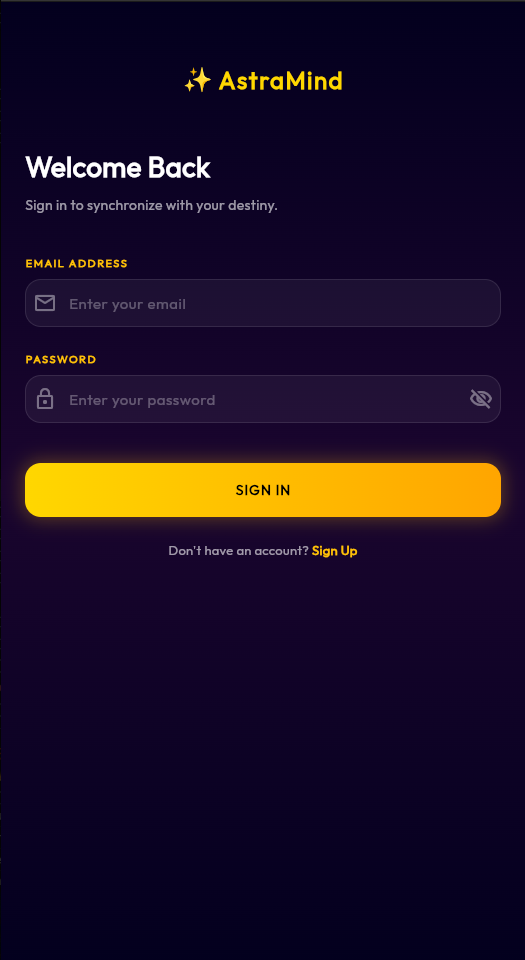
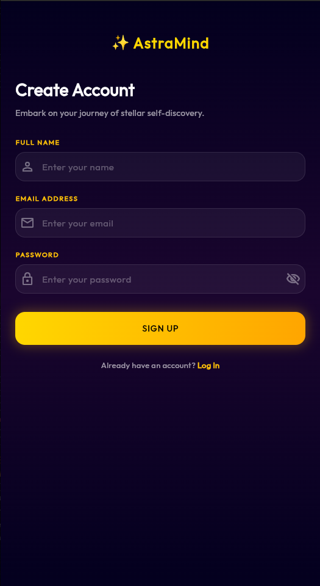
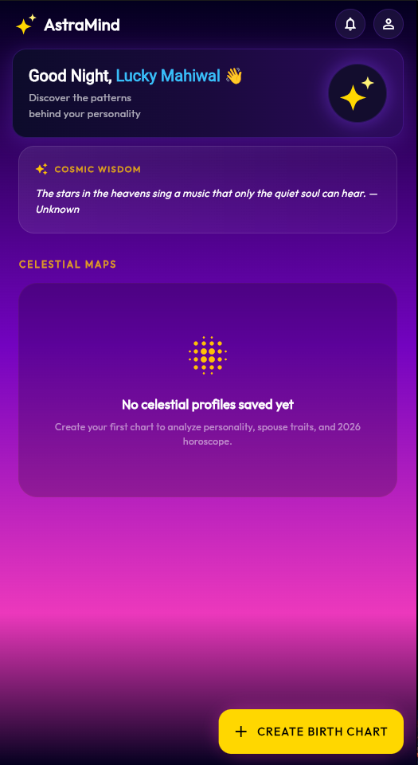
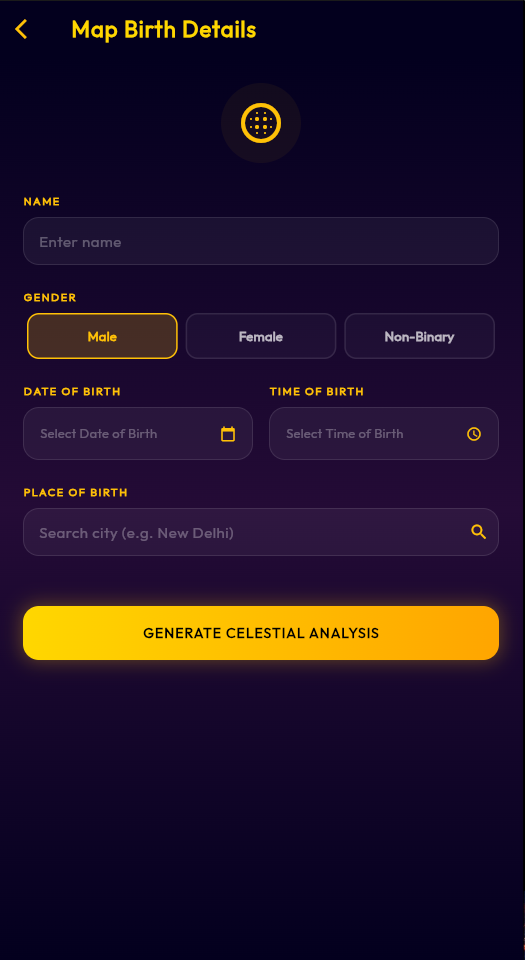
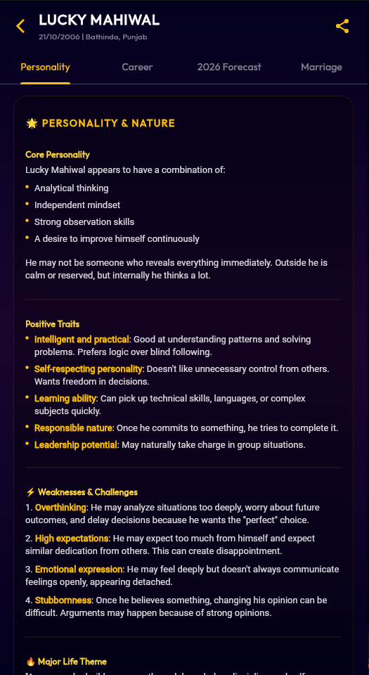

# Personality Insight App

A modern Flutter application that provides personalized personality insights through a clean and intuitive user interface. The app uses Firebase for user authentication and cloud data storage, ensuring a secure and seamless user experience.

## ✨ Features

- 🔐 Secure user authentication with Firebase Authentication
- 👤 Personalized personality insight experience
- ☁️ Cloud data storage using Cloud Firestore
- 📱 Responsive and modern Material Design UI
- ⚡ Fast and smooth cross-platform performance
- 🌙 Clean and intuitive user interface

## 📸 Screenshots

<p align="center">
  
  
  
  
  
  
</p>

## 🛠️ Tech Stack

- **Framework:** Flutter
- **Language:** Dart
- **Backend:** Firebase
- **Authentication:** Firebase Authentication
- **Database:** Cloud Firestore

## 📂 Project Structure

```
lib/
├── models/
├── screens/
├── services/
├── widgets/
├── utils/
└── main.dart
```

## 🚀 Getting Started

### Prerequisites

- Flutter SDK
- Dart SDK
- Android Studio or VS Code
- Firebase Project

### Installation

1. Clone the repository

```bash
git clone https://github.com/Lucky-Mahiwal/Personality_Insight_App.git
```

2. Navigate to the project

```bash
cd Personality_Insight_App
```

3. Install dependencies

```bash
flutter pub get
```

4. Configure Firebase

- Create a Firebase project.
- Add Android/iOS apps.
- Download the required Firebase configuration files.
- Enable Firebase Authentication and Cloud Firestore.

5. Run the application

```bash
flutter run
```

## 📦 Dependencies

Some of the major packages used include:

- firebase_core
- firebase_auth
- cloud_firestore
- provider (if used)
- google_fonts (if used)
